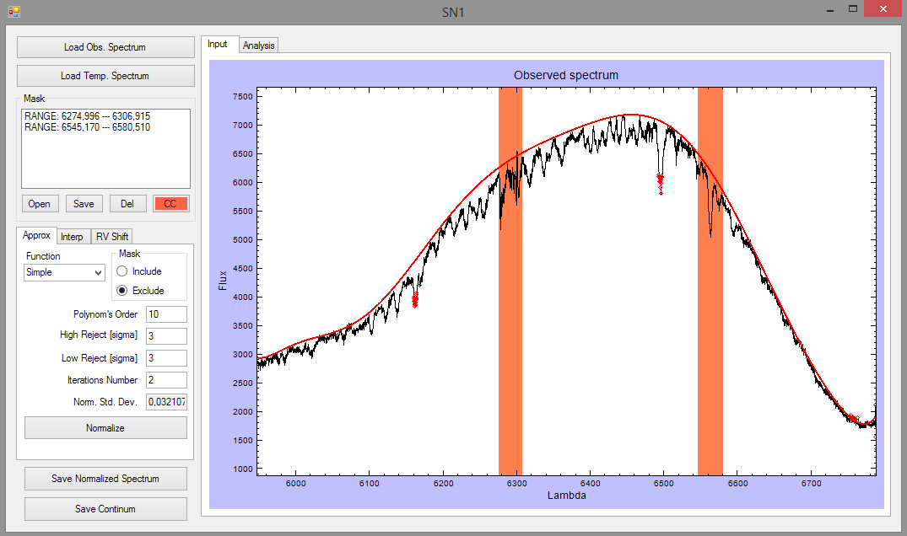
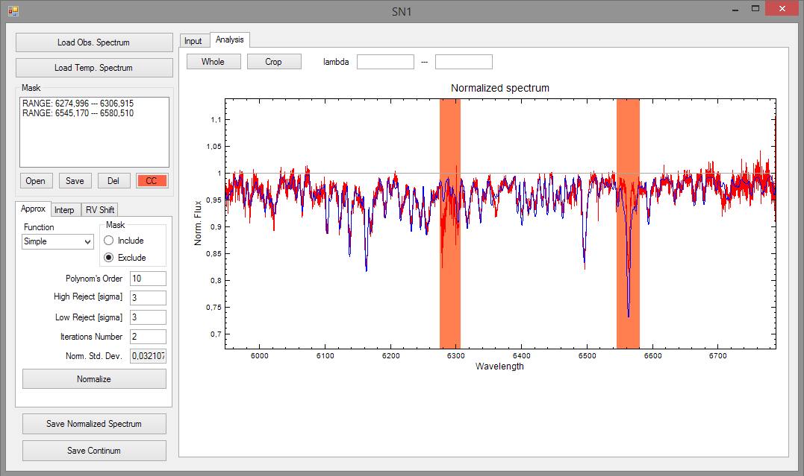

SN1 - Spectra Normalization program
---

SN was developed for normalization of stellar spectra to the continuum level. The spectra normalization is a quit hard work especially for cool stars due to strong line blending. This program models the continuum by low degree polynomial and its coefficients are searched by minimization of the discrepancy between the observed spectrum and the normalized theoretical spectrum which is multiplied to the polynomial.
---

This program was used for spectra normalization of two magnetoactive stars He373 and AP225 belonged to Alpha Per cluster. The normalized spectra were then used for LSD-reconstruction of photospheric line profiles and the investigation of the chromospheric emission in H alpha line. The link to the article: [Kolbin, Tsymbal 2016](https://link.springer.com/article/10.1134%2FS1063772917060063).
